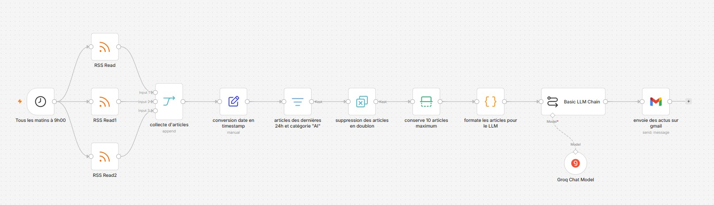

# 🤖 Veille IA quotidienne — n8n + Groq + Gmail

Workflow n8n de veille sectorielle entièrement automatisé. Chaque matin à 9h00, il collecte les derniers articles de 3 sources RSS spécialisées en intelligence artificielle, filtre et déduplique les contenus, puis génère un bulletin de veille structuré via un LLM avant de l'envoyer par email.



---

## ⚙️ Fonctionnement

```
3 flux RSS → Fusion → Filtrage 24h + catégorie "AI"
→ Déduplication → Top 10 → Formatage → LLM (Groq) → Email Gmail
```

### Étapes détaillées

| # | Nœud | Description |
|---|------|-------------|
| 1 | **Schedule Trigger** | Déclenchement automatique tous les matins à 9h00 |
| 2 | **RSS Read ×3** | Lecture en parallèle de 3 flux RSS (AI News, TechCrunch, The Verge) |
| 3 | **Merge** | Fusion des 3 flux en un seul flux d'articles |
| 4 | **Set** | Conversion des dates `isoDate` en timestamp Unix pour le tri |
| 5 | **Filter** | Sélection des articles des dernières 24h catégorisés "AI" |
| 6 | **Remove Duplicates** | Suppression des doublons par comparaison de titre |
| 7 | **Limit** | Conservation des 10 articles maximum |
| 8 | **Code (JS)** | Formatage structuré des articles pour le prompt LLM |
| 9 | **Basic LLM Chain** | Génération du bulletin de veille via Groq (LLaMA 3.3 70B) |
| 10 | **Gmail** | Envoi du bulletin par email |

---

## 📰 Sources RSS

- [Artificial Intelligence News](https://www.artificialintelligence-news.com/feed/)
- [TechCrunch](https://techcrunch.com/feed/)
- [The Verge — AI](https://www.theverge.com/rss/ai-artificial-intelligence/index.xml)

---

## 📧 Format du bulletin généré

Le LLM produit un bulletin structuré en français, incluant :

- **Top 5 des actus du jour** — titre, catégorie, résumé, impact, source
- **Tendance du jour** — dynamique principale observée
- **À surveiller** — signaux faibles et sujets émergents

---

## 🛠️ Stack technique

| Outil | Rôle |
|-------|------|
| [n8n](https://n8n.io) | Orchestration du workflow |
| RSS (3 sources) | Collecte des actualités IA |
| [Groq](https://groq.com) — LLaMA 3.3 70B | Génération du bulletin de veille |
| Gmail | Envoi de l'email quotidien |

---

## 🚀 Installation

### Prérequis

- Instance n8n (self-hosted ou cloud)
- Compte [Groq](https://console.groq.com) avec clé API
- Compte Gmail avec OAuth2 configuré dans n8n

### Import du workflow

1. Télécharger le fichier `Veille_IA.json`
2. Dans n8n : **Workflows** → **Import from file**
3. Configurer les credentials :
   - `Groq account` → ajouter votre clé API Groq
   - `Gmail account` → connecter via OAuth2
4. Activer le workflow (toggle en haut à droite)

---

## 📁 Structure du repo

```
.
├── README.md
├── Veille_IA.json        # Workflow n8n exporté
└── veille-sectorielle.jpg  # Capture du workflow
```
